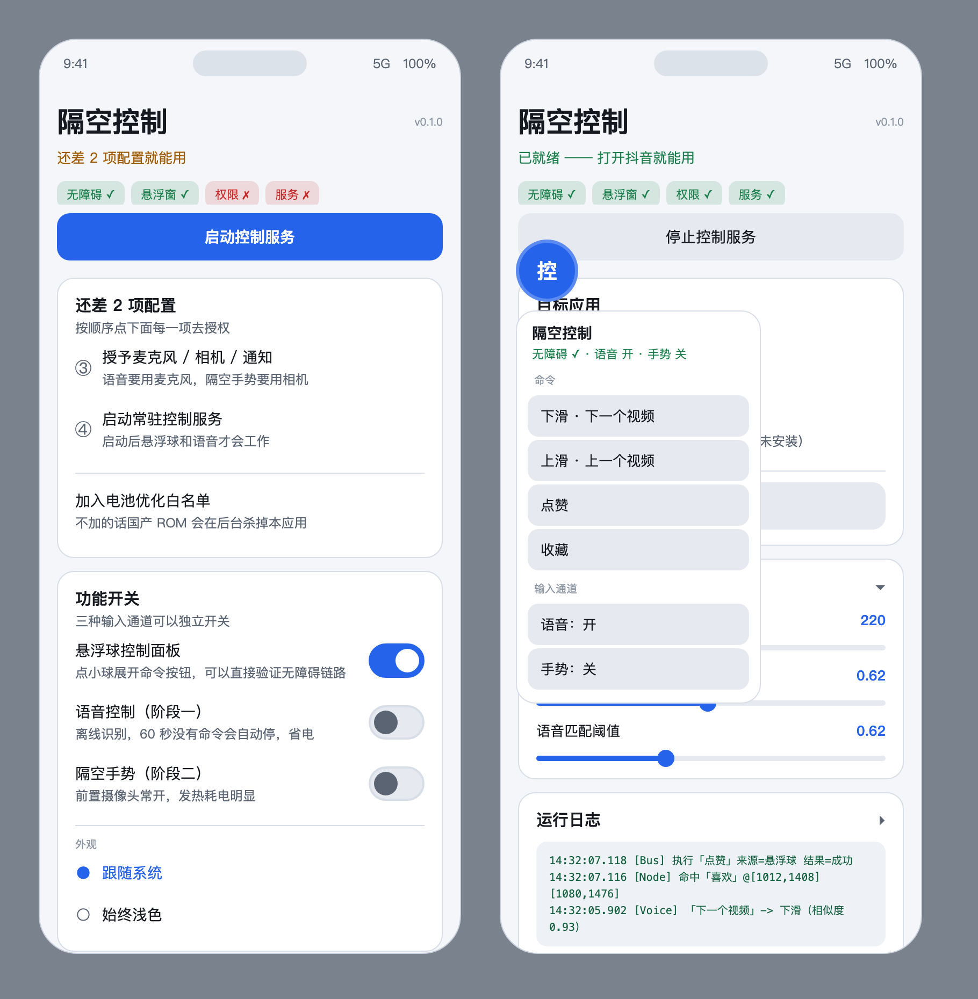
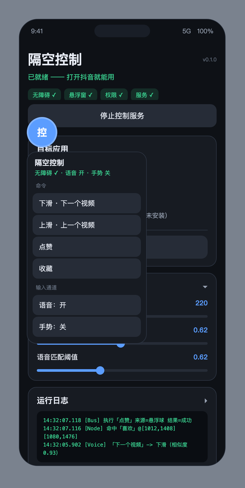

# 隔空控制 · Air Gesture Control

> 一个**免 root** 的 Android 应用：用**离线语音**（阶段一）或**隔空手势**（阶段二）免提操作抖音 —— 上滑、下滑、点赞、收藏、关注、进入/退出直播间。

**不联网、不要 root、不需要连电脑。** 语音用内置的 Vosk 中文模型，手势用内置的 MediaPipe 手部关键点模型，全部本地推理；APK 里连 `INTERNET` 权限都没有。

```
packageName : com.gesturecontrol
minSdk      : 26 (Android 8.0)
targetSdk   : 35 (Android 15)
APK 体积     : 约 98 MB（两个模型都内置在里面）
```

---

## 一、界面

| 浅色（默认跟随系统） | 深色 |
|---|---|
|  |  |

（左图：还没配置完的样子，会直接把待办项列出来；右图：已就绪 + 悬浮球面板展开）

> 预览图是 headless Chrome 按 `colors.xml` 的真实色值和尺寸渲染的 HTML 复刻，
> **不是真机截图**，但配色与尺寸与实际一致。

外观跟随系统深浅色，也可以在 App 内锁定「始终浅色 / 始终深色」（功能开关卡片底部的「外观」）。

---

## 二、功能

### 阶段一：语音

| 说 | 动作 |
|---|---|
| 下滑 / 下一个 / 下一条 / 换一个 | 看下一个视频（手指上划） |
| 上滑 / 上一个 / 前一个 | 回上一个视频 |
| 点赞 / 喜欢 / 点个赞 / 比心 | 点赞（再点一次取消） |
| 收藏 / 加收藏 / 存起来 | 收藏 |
| 关注 / 加关注 | 关注 |
| 进直播间 / 看直播 | 进入直播间 |
| 退出直播间 / 不看直播了 | 退出直播间 |
| 暂停 / 继续 / 停一下 | 长按屏幕（抖音的暂停） |
| 返回 | 系统返回 |

匹配用的是**自由识别 + 模糊匹配**，不是死板的命令词表。「下一个视频」「换一个」这类不同说法都能用；
对 Vosk 常见的同音字错认（上划 / 点攒 / 收仓 / 关住）也做了变体表。匹配阈值可以在设置里调。

### 阶段二：隔空手势（前置摄像头，手在屏幕前挥动）

| 动作 | 默认触发 |
|---|---|
| 手向上挥 | 下一个视频 |
| 手向下挥 | 上一个视频 |
| 拇指食指**捏合** | 点赞 |
| 捏合**保持**约 0.9 秒 | 收藏 |
| 五指张开**保持**约 1.5 秒 | 暂停 / 继续 |

只用了**纵向**挥动 —— 前置摄像头画面是否镜像会影响左右判定，纵向不受影响，更可靠。
每个手势的映射和灵敏度都能在设置里改。

---

## 三、工作原理

核心设计：**三种输入源都只产生 `Command` 对象**，统一交给 `CommandBus` 节流后，
再由无障碍服务执行。所以加新的输入方式或新的动作，都不用动执行层。

```
  ┌───────────────┐   ┌───────────────┐   ┌───────────────┐
  │  离线语音      │   │  隔空手势      │   │  悬浮球按钮    │
  │  VoiceEngine  │   │  HandTracker  │   │  FloatingBall │
  │  (Vosk 流式)   │   │ (MediaPipe)   │   │  Controller   │
  └───────┬───────┘   └───────┬───────┘   └───────┬───────┘
          │                   │                   │
          └───────────┬───────┴───────────────────┘
                      ▼
              CommandMatcher            ← 语音文本 → 命令（F1 模糊匹配）
                      ▼
                CommandBus              ← 统一节流 / 冷却 / 日志 / 状态回调
                      ▼
      ControlAccessibilityService       ← 唯一「碰得到屏幕」的地方
              ┌───────┴────────┐
              ▼                ▼
         NodeFinder       GestureInjector
      (按文案找控件)      (dispatchGesture)
```

两条关键策略：

1. **节点优先，坐标回退**。先在无障碍节点树里按 `contentDescription` / `text` 找真实控件，
   找不到才用可校准的屏幕比例坐标。抖音改版导致文案变化时，用内置的「节点探测」页
   重新校准即可，不需要改代码。

2. **所有坐标都能调**。滑动时长、点赞/收藏/关注的 Y 比例、操作栏 X 比例、节流倍率、
   语音匹配阈值、隔空手势阈值 —— 全部在设置页有滑块，改完立即生效。

---

## 四、安装与首次配置

### 安装

**方式一：直接下载 APK（推荐）**

到 [Releases](https://github.com/only-zh/air-gesture-control/releases/latest) 下载 `air-gesture-control-v0.1.0.apk`
（约 94.5 MB，两个模型已内置），传到手机上安装即可，需要允许「安装未知来源应用」。

下载后可以校验一下完整性：

```bash
shasum -a 256 air-gesture-control-v0.1.0.apk
# ad428d1fedb87f9148e28f8de658c5fb6d02783f0aa0edaea2a6b79ebdcafb76
```

**方式二：adb 安装**

```bash
adb install -r air-gesture-control-v0.1.0.apk
```

**方式三：自己编译** —— 见下面「[从源码构建](#八从源码构建)」。

> ⚠️ 本版本使用 **debug 签名密钥**（口令为标准 Android debug 口令 `android`），
> 任何人都能重新打包一个签名相同的 APK，**不适合正式分发**。
> 好处是可以直接覆盖安装自己编译的 debug 包，不需要卸载。

### 一次性授权

打开 App，顶部会告诉你还差几项，按①→④顺序点即可：

| 步骤 | 说明 |
|---|---|
| **① 无障碍服务** | 系统设置 → 无障碍 → 已下载的服务 → **隔空控制** → 打开。**没有这一步什么都做不了** |
| **② 悬浮窗权限** | 允许，用于显示悬浮球控制面板 |
| **③ 麦克风 / 相机 / 通知** | 首页点一下批量申请 |
| **④ 启动控制服务** | 首页的大按钮 |

另外强烈建议：

- **加入电池优化白名单**（首页有待办入口），否则国产 ROM 会在后台杀掉本应用
- **允许自启动 / 后台弹出界面**（小米、OPPO、vivo、华为需要在系统「应用管理」里手动允许）

### 建议的第一次使用顺序

**先只开悬浮球。** 点小球展开面板，一个个点命令按钮，
确认上滑、点赞、收藏都真的作用在抖音上了，再去开语音和隔空手势。

这样能把「无障碍链路的问题」和「语音识别的问题」分开排查 —— 否则出问题时你不知道是哪一层坏了。

---

## 五、出问题了怎么办

App 首页的「运行日志」会写清楚每条命令是**谁触发的、成功还是失败**，出问题先看它（可一键复制）。

| 现象 | 原因 / 解决 |
|---|---|
| 点命令没反应，日志显示「无障碍服务未连接」 | 无障碍服务被系统杀了。重新打开，并把 App 加入电池白名单 |
| 日志显示「当前前台是 xxx，不是抖音」 | 这是「只在目标 App 前台时响应」的保护，切到抖音即可 |
| 上滑下滑有效，点赞/收藏点不到 | 抖音改版了，见下一节「校准」 |
| 语音听不懂 | 调低「语音匹配阈值」，或看日志里识别成了什么 |
| 隔空手势不触发 | 调低「隔空挥动阈值」；确保光线充足、手离摄像头 30–60cm；展开悬浮球面板能看到实时的 `dy/dx/捏合度` 调试信息 |
| 手势一直重复触发 | 调高「隔空挥动阈值」或「节流倍率」 |
| 悬浮球不见了 | 检查悬浮窗权限；或服务被杀了，重新「启动控制服务」 |

### 校准（抖音改版后必做）

打开 App → 「校准与工具」→ **节点探测 / 校准**：

1. 点「立即抓取当前页面节点」—— 会把抖音当前页面上所有控件的
   `id / text / desc / 坐标` 全部列出来（优先抓抖音自己的窗口，因为探测页自己占着前台）
2. 抓不到就先点「3 秒后抓取」，然后切到抖音，3 秒后再切回来
3. 在列表里找点赞、收藏按钮真实的 `desc`（新版本可能叫别的）
4. 用页面上的「关键词定位」直接试：输入关键词，能命中就会显示坐标
5. 如果按钮的 `desc` 变了：把新文案加进
   `app/src/main/java/com/gesturecontrol/a11y/DouyinActions.kt` 的关键词列表，重新编译
6. 如果按钮根本不是可点击节点：回首页调「点赞按钮 Y」「操作栏 X」等滑块用坐标兜底 ——
   **这一步不用重新编译**

---

## 六、已知限制

1. **抖音改版会让文案定位失效。** 不可避免，所以内置了节点探测页和坐标回退。
2. **高频自动点赞可能触发平台风控。** 默认有节流（点赞 700ms、进/退直播间 1500ms 冷却），
   可以在设置里把「节流倍率」调大。
3. **国产 ROM 会杀后台无障碍服务。** 必须加电池优化白名单 + 自启动。
4. **隔空手势需要前置摄像头常开**，有明显耗电发热，只在需要时开。
5. **暂停是靠无障碍的「持续按压」模拟长按**（`willContinue` + `continueStroke` 续接松手），
   不同机型/抖音版本表现可能不一致，代码里有 20 秒强制松手的兜底。
6. **语音常驻聆听耗电**，默认 60 秒没有命令就自动停止听音。
7. **目前只适配了抖音 / 抖音极速版。** 适配其它 App 的思路见下面「后续计划」。
8. **本项目只在两台状态上验证过**：静态逻辑有单元测试覆盖（22 个用例），
   真机上抖音的五个核心动作（上下滑、点赞、收藏、进出直播间）已跑通；
   但语音和隔空手势两条链路**尚未真机验证**。

---

## 七、免责声明

本项目是**在自己手机上、用 Android 官方无障碍能力操作自己账号**的工具，仅供个人学习与无障碍辅助使用。

- **请遵守抖音的用户协议**，不要用于刷量、营销、爬取或任何自动化滥用
- 代码里**刻意没有实现**评论区发言、自动送礼物、挂机定时刷视频这类功能 ——
  它们要么有误操作的真实风险（说话被识别成评论内容、误触送出真金白银），要么是典型的刷量特征
- 使用本工具产生的任何后果（包括但不限于账号被限制）由使用者自行承担

---

## 八、从源码构建

### 环境

只需要 macOS / Linux + `curl` + `unzip`。**不需要**预装 Android Studio、Gradle 或 Android SDK ——
脚本会把它们装进工程目录内的 `.toolchain/`，不污染系统环境。

（本机原有 JDK 25 对 AGP 来说太新，所以脚本会单独装一个 JDK 21。）

### 三条命令

```bash
tools/setup-toolchain.sh     # 一次性：JDK 21 + Android SDK + Gradle + 手势模型 + debug 密钥
tools/fetch-vosk-model.sh    # 下载 Vosk 中文语音模型到 assets（8 路并行，约 1-2 分钟）
tools/build.sh               # 编译，产物 app/build/outputs/apk/debug/app-debug.apk
```

常用附加命令：

```bash
tools/build.sh testDebugUnitTest   # 跑单元测试（命令匹配 + 手势判定，22 个用例）
tools/build.sh clean
```

### 为什么有单独的模型下载脚本

`tools/setup-toolchain.sh` 会拉手势模型（7.8MB，很快），但**语音模型不走它**：
Vosk 官方源对单连接限速到约 30KB/s，44MB 要下 25 分钟。
`tools/fetch-vosk-model.sh` 用 8 路并行 Range 请求下载再拼接，实测快 5–10 倍，
而且支持断点续传（分段失败只补那一段）。

两个模型都不入版本库（加起来 73MB），已在 `.gitignore` 里排除。

---

## 九、工程结构

```
app/src/main/java/com/gesturecontrol/
├── core/       Command 命令枚举 · CommandBus 统一节流入口 · CommandMatcher 模糊匹配
│               Prefs 全部可调参数 · AppLog 内存日志
├── a11y/       ControlAccessibilityService 执行层 · GestureInjector 手势注入
│               NodeFinder 按文案找控件 · DouyinActions 抖音动作 · ScreenWatcher 前台跟踪
├── voice/      VoiceEngine：AudioRecord + Vosk 流式识别，含 assets 模型解包
├── air/        HandTracker CameraX+MediaPipe · AirGestureController 关键点→命令
│               TrajectoryDetector 挥动/捏合判定（纯 Kotlin，无 Android 依赖，可单测）
├── overlay/    FloatingBallController 悬浮球控制面板
├── service/    ControlService 唯一前台服务，托管悬浮球 + 语音 + 手势
├── debug/      NodeInspectorActivity 节点探测 / 校准
├── ui/         UiKit 界面组件库（卡片 / 行 / 按钮 / 滑块 / 状态胶囊 / 日志块）
├── MainActivity.kt
└── App.kt

app/src/test/java/com/gesturecontrol/
├── core/CommandMatcherTest.kt      (9 个用例)
└── air/TrajectoryDetectorTest.kt   (13 个用例)

tools/          setup-toolchain.sh · fetch-vosk-model.sh · build.sh
docs/           界面预览图
```

`TrajectoryDetector` 刻意做成零 Android 依赖，就是为了在没有真机的情况下也能把
「挥手方向 / 捏合 / 张手判定」的正确性验证掉 —— 这也是这个项目里唯一能自动验证的部分。

---

## 十、技术选型与踩过的坑

| 依赖 | 版本 | 说明 |
|---|---|---|
| `com.google.mediapipe:tasks-vision` | **0.10.14（必须锁死）** | 0.10.22 及以后的 AAR **不再包含** `libmediapipe_tasks_vision_jni.so`，装到手机上会 `UnsatisfiedLinkError`。已验证 0.10.14 的 AAR 里 arm64/armeabi/x86 三个 so 都在 |
| `com.alphacephei:vosk-android` | 0.3.75 | 自带 JNA 5.18.1 |
| CameraX | 1.3.4 | `ImageProxy.toBitmap()` 免去手写 YUV→RGB |
| AGP / Gradle / JDK / Kotlin | 8.7.3 / 8.9 / 21 / 2.0.21 | compileSdk 35，minSdk 26 |

开发过程中踩到并修掉的问题，记录在这里避免重复踩：

- **`GestureDescription` 没有 `cancel()`。** 查 `android.jar` 确认过。抖音的「暂停」是长按不放，
  只能用官方的 `willContinue=true` + `continueStroke(..., false)` 续接机制模拟「按住/松手」。
- **媒体播放器式的 Slider 不能直接喂小数。** Material Slider 对 `value` 与 `stepSize` 的
  浮点一致性检查很严，`0.62 / 0.01` 会因浮点误差抛 `IllegalStateException`，所以滑块内部一律走整数刻度。
- **Material 主题属性名版本差异大。** `sliderTrackHeight` 之类的名字在 Material 1.12 里不存在，
  正确名是 `trackHeight` / `thumbRadius`；干脆改成代码里设置更稳。
- **`MaterialCardView` 是 `FrameLayout`。** 直接 `addView` 标题和内容两块会**重叠**，必须包一层纵向容器。
- **语音匹配只看「是否包含关键词」会判反。** 用户漏说一个字时，「退直播间」包含「直播间」，
  会被判成**进入**直播间 —— 方向完全相反。改成 F1 打分（同时惩罚「关键词没说全」和「说了多余的字」）才修好。
  这个 bug 是单元测试抓出来的。
- **无障碍 API 必须在主线程调用。** Vosk 和 MediaPipe 的回调都在各自的后台线程，
  所以要往主线程抛一次再碰无障碍 API。
- **MediaPipe 的传递依赖会带进 `INTERNET` 权限和 Google 遥测组件。**
  本应用运行时完全不需要网络，所以用 `tools:node="remove"` 直接移除了联网权限 ——
  让「不联网」从一句声明变成系统层面强制的事实（`aapt dump badging` 可验证）。

---

## 十一、后续计划

- **适配哔哩哔哩**。B 站比抖音复杂：它有竖屏沉浸流和横屏播放页两套完全不同的 UI，
  播放页的控制栏还会自动隐藏（需要「先点屏幕唤出 → 再定位」的级联），
  并且有抖音没有的动作（投币、弹幕开关、全屏）。这些都会在有了真机节点 dump 之后再写，
  不靠猜坐标。
- 其它扩展点（系统级动作、蓝牙遥控器、宏指令等）记录在 [ROADMAP.md](ROADMAP.md)。

---

## 十二、许可

[MIT](LICENSE) © 2026 only-zh

第三方组件：Vosk（Apache-2.0）、MediaPipe（Apache-2.0）、AndroidX / Material Components（Apache-2.0）。
语音模型 `vosk-model-small-cn-0.22` 与手势模型 `hand_landmarker.task` 均由脚本下载，各自遵循其原始许可。
